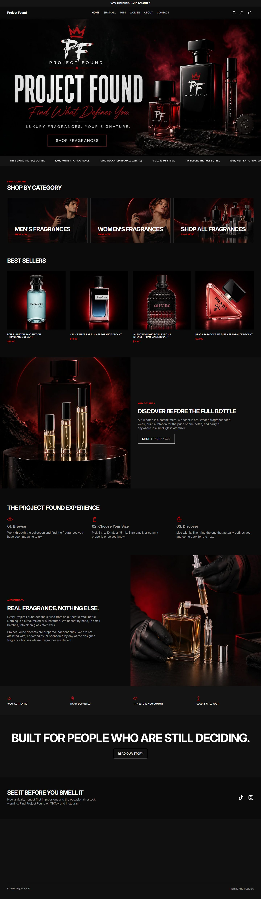

# Project Found — Custom Shopify Theme

A customized Shopify Online Store 2.0 theme for **Project Found**, by [Bilal Burney](https://github.com/BilalBurni).

🔗 **Live store:** [www.theprojectfound.com](https://www.theprojectfound.com/)

## Homepage

<!-- HOMEPAGE SCREENSHOT -->


## About this theme

- Built on Shopify's free Horizon theme, then customized with custom sections, design and features for this store.
- Uses Online Store 2.0 JSON templates, so the merchant can edit every section from the theme editor.
- Responsive layout for mobile, tablet and desktop.
- Written in Liquid, CSS and vanilla JavaScript.

## Theme at a glance

| | Count |
|---|---|
| Sections | 40 |
| Snippets | 144 |
| Theme blocks | 95 |
| Templates | 14 |

**Sections:** `_blocks`, `carousel`, `cart-drawer-section`, `collection-links`, `collection-list`, `custom-liquid`, `divider`, `featured-blog-posts`, `featured-product-information`, `featured-product`, `footer-utilities`, `footer`, `header-announcements`, `header`, `hero`, `layered-slideshow`, `logo`, `main-404`, `main-blog-post`, `main-blog`, `main-cart`, `main-collection-list`, `main-collection`, `main-page`, `marquee`, `media-with-content`, `password-footer`, `password`, `predictive-search-empty`, `predictive-search`, `product-hotspots`, `product-information`, `product-list`, `product-recommendations`, `quick-order-list`, `search-header`, `search-results`, `section-rendering-product-card`, `section`, `slideshow`

## Structure

```
assets/      CSS, JavaScript, fonts and images
config/      Theme settings schema and defaults
layout/      theme.liquid and other base layouts
locales/     Translation strings
sections/    Customizable page sections
snippets/    Reusable Liquid partials
templates/   JSON page templates
```

## Try it locally

```bash
shopify theme dev --store your-store.myshopify.com
```

---

Need a custom Shopify store? Contact me on [GitHub](https://github.com/BilalBurni).
